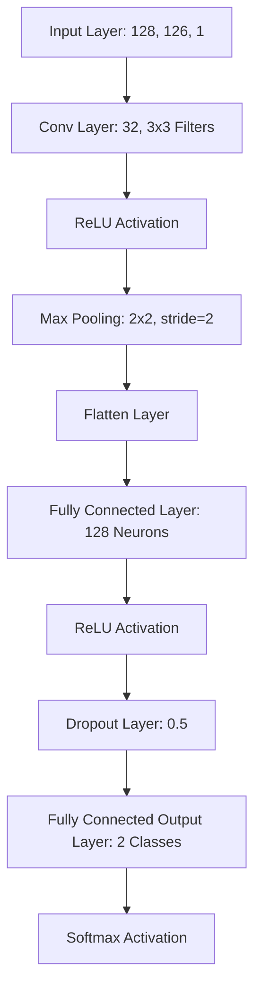

# DeepFakeVoice Detection

Project in the context of the course "Signal and Natural Language Processing with Deep Learning" at the UPV in Valencia.

## Project Objective
The project presents an approach to detect Deepfake voices iin audio recordings. 

## Dataset
The dataset used in this project is called "in-the-wild", which was created by the Fraunhofer AIESEC Institut (https://deepfake-total.com/in_the_wild)

### CNN structure

