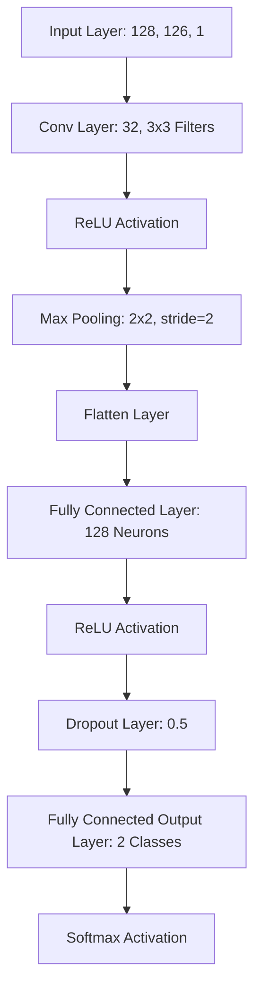

# DeepFakeVoice Detection

### CNN structure

```mermaid
graph TB
  input[Input Layer: 128, 126, 1] --> conv1[Conv Layer: 32, 3x3 Filters]
  conv1 --> relu1[ReLU Activation]
  relu1 --> pool1[Max Pooling: 2x2, stride=2]
  pool1 --> flatten[Flatten Layer]
  flatten --> fc1[Fully Connected Layer: 128 Neurons]
  fc1 --> relu3[ReLU Activation]
  relu3 --> drop[Dropout Layer: 0.5]
  drop --> output[Fully Connected Output Layer: 2 Classes]
  output --> softmax[Softmax Activation]

```
